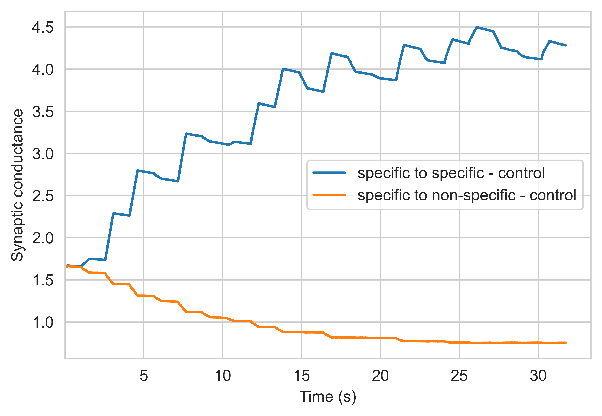

# Model of Working (Visual) Memory

- Neural network model based on [Learning in realistic networks of spiking neurons and spike-driven plastic synapses](https://pubmed.ncbi.nlm.nih.gov/15978023/)
- Long-term plasticity model is switched to spike-time dependent plasticity based on [An Integrate-and-Fire Spiking Neural Network Model Simulating Artificially Induced Cortical Plasticity](https://pubmed.ncbi.nlm.nih.gov/33632810/)

